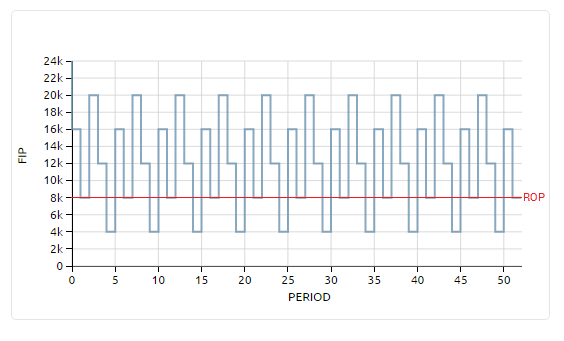

============================
Descripción de la aplicación
============================

La aplicación tiene tres vistas principales:

* **Simulation parameters**: El formulario donde se ingresan los parametros de la simulación 
* **Plot**: La gráfica del comportamiento del nivel de inventario en el tiempo
* **Statistics**: Las estadisticas de costos

Simulation parameters
---------------------------

En este formulario se ingresan los parametros de la simulación:

* el producto,
* el número de periodos que durará la simulación
* la política de abastecimiento deseada.

.. tip::

	* Se pueden crear o eliminar productos. Al momento de crear se definen las distribuciones de la demanda y tiempo de entrega, los costos por unidad y la cantidad de inventario inicial
	* El periodo debe ser un número entero positivo
	* Solo hay dos políticas en el momento: Qs y RS

Plot
----

En esta gráfica se visualiza el comportamiento del nivel de inventario a través del tiempo.

.. tip::
	Al acercar el puntero del mouse a la linea se muestra el detalle de la semana seleccionada y el valor del nivel del inventario en ese momento

Statistics
----------

En esta gráfica se visualizan los tres componentes del costo de la política de abastecimiento seleccionada: 

* costo de almacenamiento, 
* costo de ordenar
* costo de las ventas perdidas.

.. tip::
	Al acercar el puntero del mouse a una de las areas se muestra el valor del componente del costo seleccionado