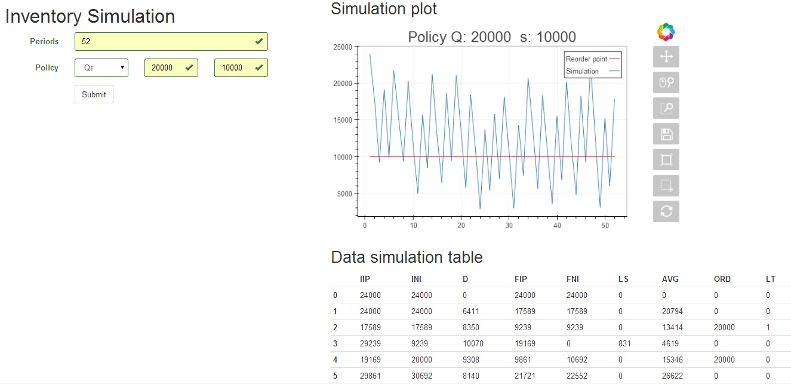

# Simulación de un sistema de Inventario

Los modelos de inventario son modelos de almacenamiento. La simulación de un sistema de 
inventario representan situaciones en las que se tiene una determinada mercancía almacenada 
y se observa su comportamiento de acuerdo a una serie de demandas y compras de la misma. 
Se pueden utilizar para comparar distintas políticas de reabastecimiento para el sistema de 
inventario y seleccionar la que ofrezca la mejor relación servicio/costo. 


# Identificación del problema

Suponemos un almacén, con un producto. Pueden realizarse pedidos de dicho producto a 
ciertos proveedores y hay clientes que llegan a comprarlos al almacén. Se debe poder decidir 
cuántos ítems de producto tener en el inventario en cada uno de los próximos n periodos. 
De acuerdo a la política de reabastecimiento se revisa el nivel del inventario y se decide 
cuántos ítems hay que pedir. 

La política de reabastecimiento del almacén responde basicamente dos preguntas:

- ¿Cuando pedir? 
- ¿Cuanto pedir?

Si es posible conocer el nivel de inventario en tiempo real, la aplicación ofrece la política 
de reabastecimiento (Q,s). Si el nivel almacenado es inferior o igual a un punto de reorden "s", 
se piden "Q" unidades.

Si solo se pueden hacer verificaciones del inventario cada cierto periodo de tiempo, esta 
disponible la política (R,S). Cada "R" periodos se revisa el nivel de inventario, si el nivel 
almacenado es superior a "S" no se realiza petición, si no es así se pedirá hasta llegar a "S".


# Supuestos

Solo hay un producto disponible con las siguientes caracteristicas que pueden ser editadas dentro
del código:

- Se inicia con un inventario de 24000 unidades. 
- La demanda es aleatoria y se conoce su distribución de probabilidad. La distribución es normal con media: 8000 y desviación estandar 1000. En otras palabras la demanda por periodo estará mas o menos entre 6000 y 10000 unidades por periodo.
- El lead time es aleatorio y se conoce su distribución de probabilidad. La distribución es triangular con min 0 moda 1 y max 2. Es decir, estará entre 0 y 2, con mayor probabilidad de ser 1.
- El precio del producto es de 8 $/und.

En el momento que un cliente realiza una demanda al almacén, se satisface inmediatamente si el 
tamaño del inventario es igual o mayor que la demanda hecha. Si la demanda excede el nivel de 
inventario, la parte que no puede ser entregada será asumida como una venta perdida. 

Cuando el almacén realiza un pedido a sus proveedores, la orden no es servida inmediatamente 
sino que pasa un tiempo hasta que el producto se recibe. A este tiempo que transcurre entre 
el momento que se realiza la orden y el instante en que se recibe, se le conoce como "lead time".

Al momento de realizar los pedidos se hace en función de la posición de inventario y no del 
nivel de inventario. Esto porque la posición de inventario captura el inventario a la mano y el 
que está por llegar, de esta forma se evita la tendencia de subestimar o exceder la cantidad pedida.

# Uso Básico

Dentro de la carpeta app, ejecutar:
```python views.py runserver```



En el campo "periods" se digitan el número de periodos que durará la simulación según la unidad
de tiempo que utilices (dias, semanas, meses).

En "Policy" seleccionas la politica deseada e ingresas los argumentos. Solo hay dos en el momento Qs y RS.
Por ejemplo Qs, donde s es 10000 unidades y Q es 20000 unidades.

Presionas el botón simular para iniciar la simulación. La aplicación en la parte derecha debe
mostrar una gráfica de como se comporta el nivel de inventario de acuerdo a la política escogida
y además mostrar los resultados de la simulación en una tabla.


## Abreviaciones

- IIP: Posición de inventario inicial
- INI: Inventario neto inicial
- D: Demanda
- FIP: Posición de inventario final
- FNI: Inventario neto final
- LS: Ventas perdidas
- AVG: Inventario neto promedio
- ORD: Cantidad a ordenar
- LT: Lead time

## Aclaraciones ejemplo

Periodos: 52 semanas
Política Q: 20000, s: 10000
La demanda sigue una dist. normal con media: 8000 y desvest: 1000
Lead time sigue una dist. triangular con min=0 moda=1 y max=2.

- sem 0: Preparación datos. Inventario inicial/final == Posición inventario inicial/final
- sem 1: Demanda 6411 unds. Se descuenta al inventario. No hay ordenes pendientes.
- sem 2: Se descuenta D a IIP y INI. FIP < 10k, se realiza un pedido de 20k que llegara en un día.
- sem 3: Se actualiza IIP con el pedido anterior. Se descuenta D respectivamente. Se pierden ventas.
- sem 4: Llega el pedido de sem 2. Se actualiza INI. FIP < 10k, orden de 20k que llegará el mismo día.
- .
- .
- .
- sem 53: Fin simulación.

# TODO

- Permitir al usuario crear productos con diferentes distribuciones de demanda y lead time.
- Implementar WTForms
- Agregar más políticas (Ss, RSs)
- Mejorar los tests

